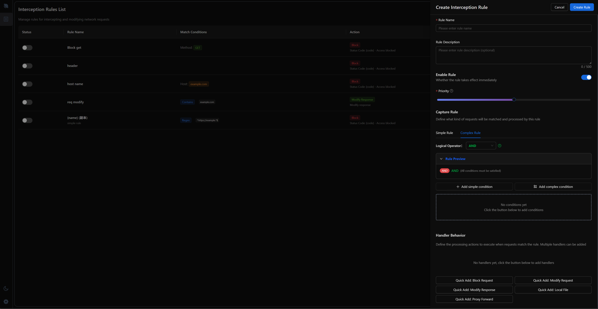

# Lynx Proxy

English | [简体中文](README.zh-CN.md)

[](./LICENSE)
[](https://crates.io/crates/lynx-core)

**Lynx Proxy** is a proxy and traffic capture tool developed in Rust, built with mainstream Rust networking libraries including hyper, axum, and tower to address various development needs, such as API inspection during mobile development, script injection, and redirecting static resources to local services during web development

## Features

- **Common Protocol Support**: Supports HTTP(S) and WS(S)
- **Web Client**: Built with modern web technologies, supports both light and dark themes
- **Rust Ecosystem**: Built on mainstream libraries like hyper, axum, and tower
- **Request Panel**:
  - List View
    
  - Tree View
    
- **Rule Capture and Processing**
  - Capture and process requests by adding rules
  - Rules
    - Simple Rules (Glob matching, regex matching, HostName, exact matching)
    - Complex Rules (AND, OR, NOR)
- **Installation and Upgrade Script Support**
  - One-line script installation, no runtime required
- **Cross-platform Support**
  - Supports Windows, macOS, and Linux platforms

## Screenshots

### HTTP/HTTPS Proxy


### WebSocket Proxy


### Tree Structure View


### Rule Configuration



## Usage

Install Lynx Proxy quickly with the one-click installation script:

```bash
curl --proto '=https' --tlsv1.2 -LsSf https://github.com/suxin2017/lynx-server/releases/latest/download/lynx-cli-installer.sh | sh
```

```bash
# Start service
lynx-cli
```

### Command Line Arguments

```
A proxy service

Usage: lynx-cli [OPTIONS]

Options:
  -p, --port <PORT>            proxy server port [default: 3000]
      --log-level <LOG_LEVEL>  log level [default: silent] [possible values: silent, info, error, debug, trace]
      --data-dir <DATA_DIR>    data dir if not set, use default data dir
  -h, --help                   Print help
  -V, --version                Print version
```

## Contributing

Community contributions are welcome! Please follow this process to participate in development:

1. Fork this repository
2. Create a new branch: `git checkout -b feature-branch`
3. Install dependencies
   - Install [taskfile](https://taskfile.dev/)
   - Install UI dependencies
     ```bash
     task setup-ui
     ```
   - Start development environment
     ```bash
     task dev
     ```
4. Commit changes: `git commit -am 'Add new feature'`
5. Push branch: `git push origin feature-branch`
6. Create Pull Request

## License

This project is licensed under the MIT License. See the [LICENSE](LICENSE) file for details.

## Contact Us

For any questions or suggestions, please submit feedback through GitHub Issues.

## Project Status

The project is still under active development, welcome to follow and participate!

## Future Plans

https://v0-modern-proxy-tool-wq.vercel.app/
