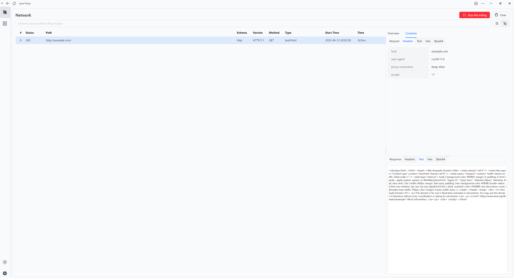
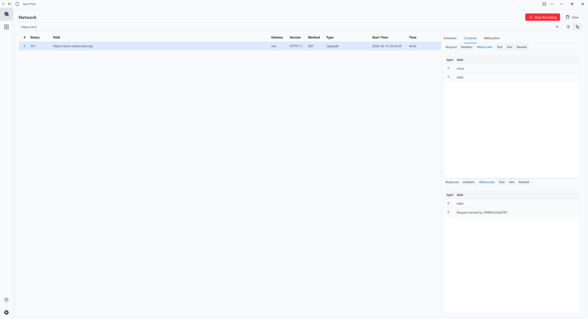
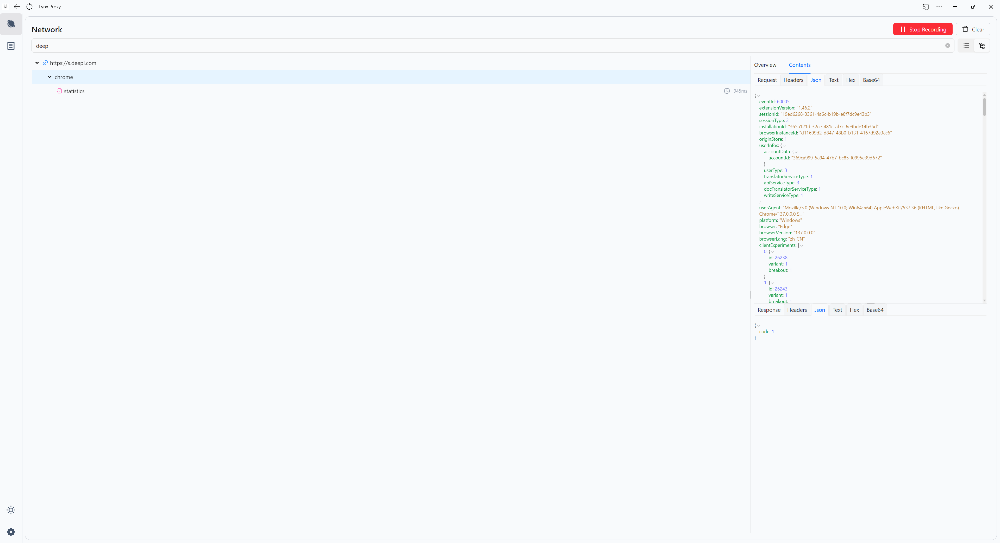
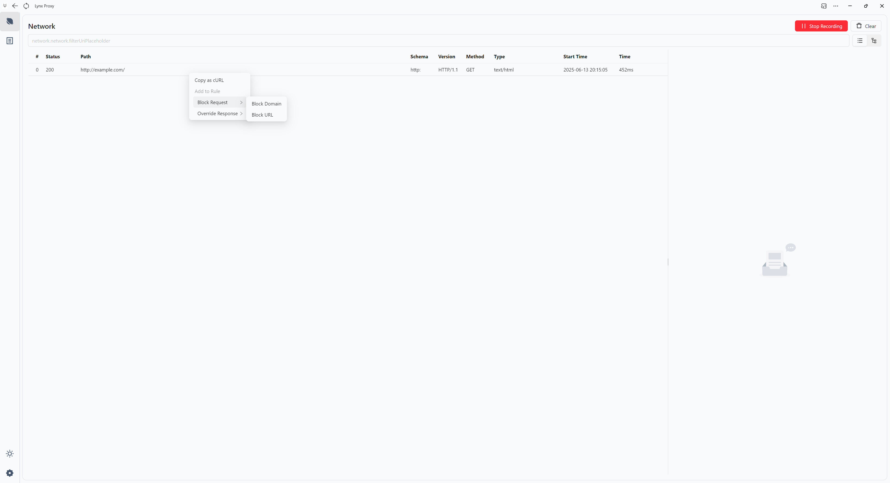
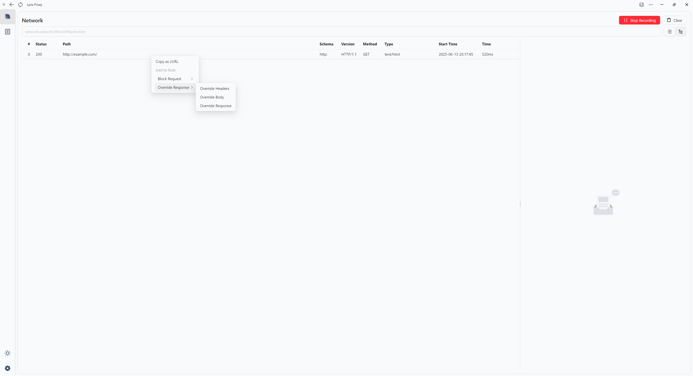

# Lynx Proxy

English | [简体中文](README.zh-CN.md)

[](./LICENSE)
[](https://crates.io/crates/lynx-core)

**Lynx Proxy** is a proxy and traffic capture tool developed in Rust, built with mainstream Rust networking libraries including hyper, axum, and tower to address various development needs, such as API inspection during mobile development, script injection, and redirecting static resources to local services during web development

## Features

- **Common Protocol Support**: Supports HTTP(S) and WS(S)
- **Web Client**: Built with modern web technologies, supports both light and dark themes,support PWA
- **Rust Ecosystem**: Built on mainstream libraries like hyper, axum, and tower
- **Request Panel**:
  - List View
  - Tree View 
- **Rule Capture and Processing**
  - Capture and process requests by adding rules
  - Rules
    - Simple Rules (Glob matching, regex matching, HostName, exact matching)
    - Complex Rules (AND, OR, NOR)
- **Installation and Upgrade Script Support**
  - One-line script installation, no runtime required
- **Cross-platform Support**
  - Supports Windows, macOS, and Linux platforms

## Screenshots

### HTTP/HTTPS Proxy



### WebSocket Proxy



### Tree Structure View



### Rule Configuration


### One Click Add Rule




### Cli 

```bash
PS C:\Users\xx> lynx-cli status
=== Lynx Proxy Service Status ===
PID: 101744
Port: 7788
Status: Running
Data Directory: Your Data Dir
Start Time: 1749816127 seconds since epoch
Process Running: Yes
```

## Usage

### Installation

#### Bash
```bash
curl --proto '=https' --tlsv1.2 -LsSf https://github.com/suxin2017/lynx-server/releases/latest/download/lynx-cli-installer.sh | sh
```

#### Powershell 

```powershell
powershell -ExecutionPolicy Bypass -c "irm https://github.com/suxin2017/lynx-server/releases/latest/download/lynx-cli-installer.ps1 | iex"
```

### Quick Start

```bash
lynx-cli run
```

### Command Line Arguments

```
Lynx Proxy Server

Usage: lynx-cli.exe <COMMAND>

Commands:
  start    Start the background proxy service
  stop     Stop the background proxy service
  restart  Restart the background proxy service
  status   Show background proxy service status
  run      Start the proxy server in foreground mode
  help     Print this message or the help of the given subcommand(s)

Options:
  -h, --help     Print help
  -V, --version  Print version
```

### Start
```
Start the background proxy service

Usage: lynx-cli.exe start [OPTIONS]

Options:
  -p, --port <PORT>          proxy server port [default: 7788]
      --data-dir <DATA_DIR>  data dir The default data directory path following OS conventions: - Linux: ~/.local/share/lynx - macOS: ~/Library/Application Support/lynx - Windows: %APPDATA%\suxin2017\lynx\data
  -h, --help                 Print help
```

### Run
```
Start the proxy server in foreground mode

Usage: lynx-cli.exe run [OPTIONS]

Options:
  -p, --port <PORT>            proxy server port [default: 7788]
      --data-dir <DATA_DIR>    data dir The default data directory path following OS conventions: - Linux: ~/.local/share/lynx - macOS: ~/Library/Application Support/lynx - Windows: %APPDATA%\suxin2017\lynx\data
      --log-level <LOG_LEVEL>  Log level for the proxy server [default: info] [possible values: silent, info, error, debug, trace]
  -h, --help                   Print help
```

## Contributing Guide

Community contributions are welcome! Please follow these steps to participate in development:

1. Fork this repository
2. Create a new branch: `git checkout -b feature-branch`
3. Install dependencies
   - Install [taskfile](https://taskfile.dev/)
   - Install UI related dependencies
     ```bash
     task setup-ui
     ```
   - Start development environment
     ```bash
     task dev
     ```
4. Commit changes: `git commit -am 'Add new feature'`
5. Push branch: `git push origin feature-branch`
6. Create Pull Request

## License

This project is licensed under the MIT License. See the [LICENSE](LICENSE) file for details.

## Contact Us

For any questions or suggestions, please submit feedback through GitHub Issues.

## Project Status

The project is still under active development, welcome to follow and participate!

## Future Plans

https://v0-modern-proxy-tool-wq.vercel.app/
