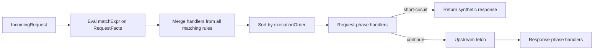

# Lynx Proxy

English | [简体中文](README.zh-CN.md)

[](./LICENSE)
[](https://crates.io/crates/lynx-core)

**Lynx Proxy** is a Rust-based HTTP(S) / WebSocket proxy and traffic inspector for local development. Built on hyper, axum, and tower, it helps you inspect APIs, rewrite traffic with rules, inject scripts, and point static assets to local services — without installing a separate runtime.

## Why Lynx

- **Single binary** — install with one script; the Web UI ships inside the CLI.
- **Local-first** — bind to loopback by default; your traffic stays on your machine.
- **Developer-oriented** — list & tree views, DSL filters, rules, and a built-in Compose panel.

## Features

### Protocols & client

- HTTP(S) and WebSocket(S) interception
- Embedded Web UI (Vue 3 + Vite), light/dark theme, PWA-friendly
- Real-time request stream over WebSocket

### Network panel

- **Table view** — sortable virtualized list with request/response detail
- **Tree view** — group by host and path
- **DSL filter** — filter captured traffic with match expressions
- **Focus / Ignore** — quick capture filters from the toolbar or context menu

### Rules

Rules let you **rewrite / mock / block / redirect** traffic based on a **match expression** (`matchExpr`). A rule contains:

- a **match expression** (`matchExpr`)
- one or more **actions** (backend calls them handlers)
- `enabled` (on/off) and `priority` (ordering among rules)

The network panel **DSL filter** uses the same syntax as `matchExpr`, but it **only filters the UI list** and does not rewrite traffic.

#### 3‑minute quickstart (UI)

1. Start Lynx and open the Web UI.
2. Open **Rules drawer** and select a **project** tab (or keep `Default`).
3. Click **New**, then fill:
   - **matchExpr**: `httpbin.org AND /anything`
   - Add an action: **Modify response** → set body to `hello from lynx`
   - Turn **Enabled** on, then **Save**.
4. Trigger a request that matches (e.g. visit `https://httpbin.org/anything`) and verify the response is replaced.

Tip: `task readme-demo` seeds demo traffic + demo rules (see `scripts/fixtures/demo-rules.json`).

#### Common recipes (copy/paste)

**Block an endpoint**

```text
example.com AND /api/v1/forbidden
```

Action: **Block** → `statusCode=403`, `reason="Blocked by Lynx rule"`.

**Inject a request header for POST only**

```text
httpbin.org AND -X POST
```

Action: **Modify request** → add header `X-Lynx-Demo: readme`.

**Redirect upstream (proxy forward)**

```text
example.com AND /static/**
```

Action: **Proxy forward** → point `targetScheme/targetAuthority/targetPath` to your local dev server.

**Serve a local file**

```text
example.com AND /assets/app.js
```

Action: **Local file** → `filePath=/abs/or/relative/path/app.js`.

#### How matching & execution works

- Every **enabled** rule whose `matchExpr` matches the request is included (not first‑match‑only).
- Actions from all matching rules are merged and run by **`executionOrder` ascending** (lower runs first).
- **Block** and **Local file** can return a response in the request phase and skip the upstream call.
- After the upstream response, response‑phase actions (e.g. **Modify response**, **HTML script injector**, **Delay** with `afterRequest/both`, **Throttle**) run again on the response body/stream.


```mermaid
flowchart LR
  req[IncomingRequest] --> match[Eval matchExpr on RequestFacts]
  match --> merge[Merge handlers from all matching rules]
  merge --> sort[Sort by executionOrder]
  sort --> reqHandlers[Request-phase handlers]
  reqHandlers -->|short-circuit| resp[Return synthetic response]
  reqHandlers -->|continue| upstream[Upstream fetch]
  upstream --> resHandlers[Response-phase handlers]
```

**Focus / Ignore** (toolbar or context menu) uses domain capture filters in Settings, not `matchExpr`. You can still right-click a request to copy cURL or create a rule from its URL.

#### matchExpr DSL

Expressions combine URL-like fragments with optional curl-style flags. Logical operators `AND`, `OR`, `NOT` (and `and` / `or` / `not`) and parentheses are supported. Line comments start with `#`.

| Form | Example | Meaning |
|------|---------|---------|
| Host | `example.com` | Host match (includes subdomains, e.g. `api.example.com`) |
| Host + port | `example.com:8080` | Host and port |
| Path | `/api/v1` | Path prefix (`/api` also matches `/api/foo`) |
| Glob | `/api/*/v1`, `/api/**/track` | Single-segment `*` or multi-segment `**` |
| Full URL | `https://example.com/api?a=1` | Scheme, host, port, path, query |
| Query only | `?user_id=123` | Query parameter **subset** match (extra params allowed) |
| Logic | `A AND B`, `NOT A`, `(A OR B)` | Combine sub-expressions |

**curl-style flags** (after a URL fragment; combined with AND):

| Flag | Role |
|------|------|
| `-X` / `--request` | HTTP method, e.g. `-X POST` |
| `-H` / `--header` | Header equality, e.g. `-H Authorization=Bearer` (name case-insensitive) |
| `-q` / `--query` | Query substring, e.g. `-q foo=bar` |

Examples:

```
example.com AND /api/v1
https://example.com/health
httpbin.org AND -X POST
(example.com OR /api/) AND NOT https://example.com/health
NOT */rest/* AND -X POST
?operationName=GetFeed
```

**Matching notes**

- Path-only expressions do not check host; query-only expressions do not check path.
- Query embedded in a URL (`?a=1&b=2`) uses subset semantics; the live request may include more parameters.
- Path matching ignores the query string when the expression has no `?…` clause.
- For **origin-form** requests (path-only URI), host and port come from the **Host** header.

#### Actions

A rule may attach multiple actions; use `executionOrder` to sequence them.

| Action | Use case | Main fields |
|--------|----------|-------------|
| Modify request | Change request before forward | `modifyHeaders`, `modifyMethod`, `modifyUrl`, `modifyBody` |
| Modify response | Change response headers/body/status | `modifyHeaders`, `modifyBody`, `modifyStatusCode` |
| Block | Return an error without upstream | `statusCode`, `reason` |
| Delay | Simulate latency | `delayMs`, `varianceMs`, `delayType` (`beforeRequest` / `afterRequest` / `both`) |
| Throttle | Bandwidth/latency preset | `preset` (`Fast3G` / `Slow3G` / `Offline` / `Custom`), optional `downloadKbps`, `uploadKbps`, `latencyMs` |
| Proxy forward | Rewrite upstream target | `targetScheme`, `targetAuthority`, `targetPath` |
| Local file | Respond from disk | `filePath`, `contentType`, `statusCode` |
| HTML script injector | Inject into HTML responses | `content`, `injectionPosition` (`head` / `body-start` / `body-end`) |

Example rule (modify request headers when POSTing to httpbin):

```json
{
  "name": "Inject demo header",
  "enabled": true,
  "priority": 50,
  "capture": { "matchExpr": "httpbin.org AND -X POST" },
  "handlers": [{
    "handlerType": { "type": "modifyRequest", "modifyHeaders": { "X-Lynx-Demo": "readme" } },
    "executionOrder": 10,
    "enabled": true
  }]
}
```

#### Project rules file (`.lynx.json`)

Keep proxy rules in version control at the **project root**. The default config path is `./.lynx.json` (current working directory when you run the command). Runtime rule storage still uses `--data-dir` (OS-specific by default).

Rules are organized by **project** (tag on each rule). The UI shows project tabs; CLI uses `--project <id>` (default: active project from `data_dir/settings/projects.json`). Each rule has a stable **`id`** in `.lynx.json` for pull/apply matching.

`.lynx.json` is **JSON Schema-enabled**: it includes a top-level **`$schema`** field so VSCode/Cursor can validate and autocomplete the file.

Schema URL format (pinned to version tag): `https://raw.githubusercontent.com/xin2017338/lynx-proxy/v<version>/schemas/rules-export.schema.json`

| Command | Description |
|---------|-------------|
| `lynx rules pull` | Pull rules from `.lynx.json` → persisted rules (upsert by `id`). Creates the file if missing; backs up existing rules; does **not** delete rules omitted from the file. |
| `lynx rules push` | Push persisted rules from the proxy data directory → `.lynx.json` (merge by rule `id`). Creates the file (new `configId`) if missing. |
| `lynx rules apply` | **Toggle only** — sync `enabled` switches based on `.lynx.json` (by `id`) **within the config's project**. Does not create/delete/change rule content. If a rule exists only in the config, apply will skip it — run `lynx rules pull` first. |

To (re)generate the schema file in this repo:

```bash
lynx rules schema export --out schemas/rules-export.schema.json
```

Typical team workflow:

```bash
# after editing rules in the UI
lynx rules push --project example-project
git add .lynx.json && git commit -m "chore: update proxy rules"

# after git pull / switching branches
lynx rules pull     # sync rule definitions
lynx rules apply    # sync which rules are enabled
```

Shared flags: `--file <path>` (default `./.lynx.json`), `--data-dir <path>`, `--project <id>`.

The running proxy reloads rules from disk automatically on the next request (no restart needed).

#### Troubleshooting (when a rule “doesn’t work”)

- **UI filter vs rule**: the network panel DSL filter only hides/shows rows; it won’t rewrite traffic.
- **Project tab**: rules list is project-scoped; confirm you’re editing/enabling the rule in the active project.
- **Enabled + order**: ensure the rule is enabled and `executionOrder` is correct; another rule may short-circuit earlier (Block/Local file).
- **Match facts**: host/port may come from the `Host` header for origin-form requests; path-only or query-only expressions behave differently (see notes above).

### Compose (API debug)

Send HTTP requests from the UI, edit params/headers/body, and inspect responses — similar to Postman, integrated with the same proxy session.

### CLI

- `start` / `stop` / `restart` — background daemon
- `run` — foreground server (default port **7788**)
- `status` — process, port, and data directory
- `rules push` / `rules pull` / `rules apply` — project `.lynx.json` config (see above)

Cross-platform: **Windows**, **macOS**, **Linux**.

## Screenshots

### HTTP / HTTPS


### WebSocket


### Tree view


### Rules


### Context menu


### Compose


### CLI status

```bash
$ lynx status
=== Lynx Proxy Service Status ===
PID: 101744
Port: 7788
Status: Running
Data Directory: ~/.local/share/lynx
Start Time: 1749816127 seconds since epoch
Process Running: Yes
```

## Usage

### Install

Prebuilt releases are published on [GitHub Releases](https://github.com/xin2017338/lynx-proxy/releases). The install scripts are named **`lynx-cli-installer.*`** (cargo-dist package name), but they install the **`lynx`** command.

> **Note (v0.4.8 and earlier):** installers built before the repo rename still download binaries from `xin2017338/lynx-server` internally. The script URL can use either `lynx-proxy` or `lynx-server` — both hosts mirror the same release assets today. Future releases (after updating `repository` in `Cargo.toml`) will point entirely at `lynx-proxy`.

**macOS / Linux (recommended)**

```bash
curl --proto '=https' --tlsv1.2 -LsSf \
  https://github.com/xin2017338/lynx-proxy/releases/latest/download/lynx-cli-installer.sh | sh
```

**Windows (PowerShell)**

```powershell
powershell -ExecutionPolicy Bypass -c "irm https://github.com/xin2017338/lynx-proxy/releases/latest/download/lynx-cli-installer.ps1 | iex"
```

After install:

- Binary: **`lynx`** (not `lynx-cli`)
- Default location: `~/.cargo/bin/lynx` — add it to your `PATH` if the installer did not
- Verify: `lynx --version`

**Manual download** (from [Releases](https://github.com/xin2017338/lynx-proxy/releases)):

| Platform | Archive |
|----------|---------|
| macOS (Apple Silicon) | `lynx-cli-aarch64-apple-darwin.tar.xz` |
| Linux (x64) | `lynx-cli-x86_64-unknown-linux-gnu.tar.xz` |
| Windows (x64) | `lynx-cli-x86_64-pc-windows-msvc.zip` |

Intel Macs are not in the release matrix (avoids long `macos-13` CI queues); use the Apple Silicon build under Rosetta or build from source. ARM Linux is not in the release matrix yet — build from source (see Development).

**Build from source**

```bash
git clone https://github.com/xin2017338/lynx-proxy.git
cd lynx-proxy
task build-ui && cargo install --path crates/lynx-cli
```

### Quick start

1. Start the proxy:

   ```bash
   lynx run
   ```

2. Point your browser or app at `http://127.0.0.1:7788` (or configure the system HTTP proxy).

3. Open the Web UI at **http://127.0.0.1:7788** and enable capture.

4. Install the Lynx CA certificate from **Settings** when you need HTTPS decryption. For mobile Wi‑Fi proxy, use your computer's LAN IP (not `127.0.0.1`).

### Android one-click proxy (ADB)

In the web UI, open **Rules drawer → Android** to lazily install platform-tools (or use `adb` from `PATH`), list devices, and enable/disable the system HTTP proxy via ADB:

- **Same WiFi (LAN)** — proxy host is your computer's LAN IP and Lynx port (not available with `--local-only`).
- **USB (`adb reverse`)** — sets `127.0.0.1:<port>` on the device after port forwarding.

HTTPS still requires installing the Lynx root CA from **Settings**. Disabling Lynx does not clear the phone proxy — use **Disable proxy** in the Android panel before exit.

### Common commands

```bash
lynx run          # foreground, default port 7788
lynx start        # background daemon
lynx stop
lynx restart
lynx status
lynx rules push      # export persisted rules → ./.lynx.json
lynx rules pull      # import ./.lynx.json → persisted rules (backs up first)
lynx rules apply     # toggle-only: sync enabled switches (run pull first if needed)
lynx cert install    # macOS: trust root CA in System Keychain (admin authorization required)
lynx cert status
lynx cert uninstall
```

### Trust Lynx root CA (macOS)

For HTTPS decryption, install the Lynx root CA into your **System Keychain**:

```bash
lynx cert install
lynx cert status
```

- **macOS only** in the current release; other platforms still use manual install from **Settings** in the Web UI.
- Does not configure Firefox (separate NSS store) or apps with certificate pinning.
- Installing a trusted root CA allows local HTTPS interception — use only on machines you control.
- If you delete and recreate the data directory, run `lynx cert status` (may show `mismatch`), then `uninstall` and `install` again.
- Installing to System Keychain requires administrator authorization.

### Options (`run` / `start`)

| Option | Default | Description |
|--------|---------|-------------|
| `--port` | `7788` | Proxy listen port |
| `--data-dir` | OS-specific | Rules and persistent data |
| `--log-level` | `info` | `silent`, `info`, `error`, `debug`, `trace` |
| `--connect-type` | `sse` | `sse` or `short-poll` |
| `--local-only` | off | Bind to loopback only |

Default data directories:

- Linux: `~/.local/share/lynx`
- macOS: `~/Library/Application Support/lynx`
- Windows: `%APPDATA%\xin2017338\lynx\data`

## Development

Requires [Rust](https://rustup.rs/), [Node.js](https://nodejs.org/) 20+, and [Task](https://taskfile.dev/).

```bash
task setup-ui    # npm ci in ui/
task dev         # proxy :7788 + Vite UI :5173
task lynx -- rules push   # run local CLI without install
task dev-lynx    # foreground proxy (debug build)
```

Other useful tasks:

| Task | Purpose |
|------|---------|
| `task build-ui` | Production UI build → embedded in CLI |
| `task install-lynx` | Install debug `lynx` to `~/.cargo/bin` |
| `task lynx -- …` | Run local CLI (e.g. `task lynx -- rules pull`) |
| `task dev-lynx` | Foreground proxy from source (debug build) |
| `task traffic-sample` | Send sample HTTP(S) through the proxy |
| `task readme-demo` | Seed demo traffic & rules for docs |
| `task readme-screenshots` | Regenerate `images/*.png` (uses system Chrome) |

See [ui/README.md](ui/README.md) for UI architecture and screenshot workflow.

### Contributing

1. Fork the repo and create a branch.
2. `task setup-ui && task dev`
3. Make changes; run `task test` and `task lint` when touching Rust.
4. Open a Pull Request.

## License

MIT — see [LICENSE](LICENSE).

## Feedback

Questions and ideas: [GitHub Issues](https://github.com/xin2017338/lynx-proxy/issues).

## Status

Usable for daily development; features and UI are still evolving — contributions welcome.
