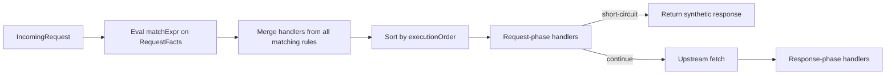
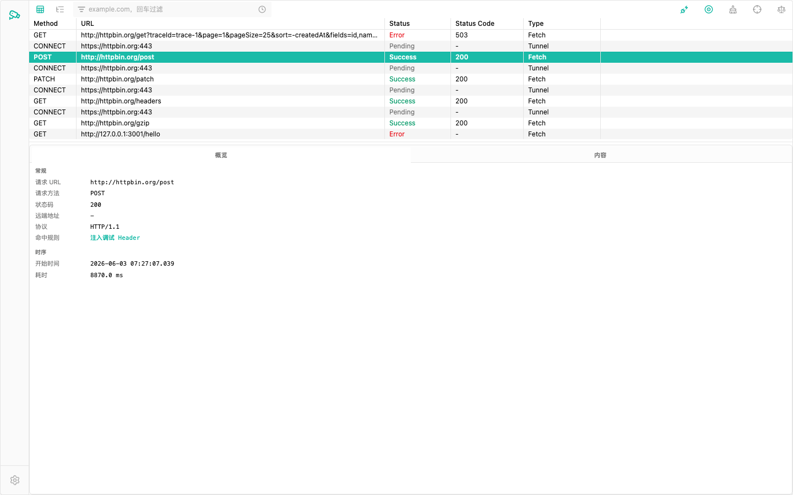
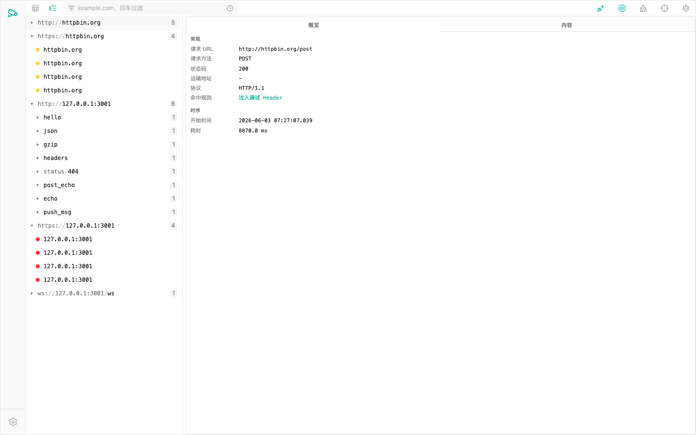
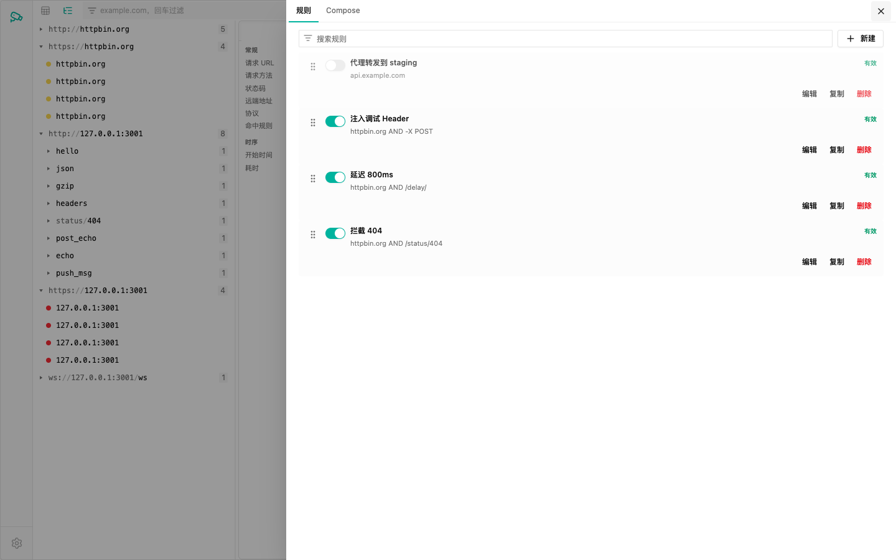
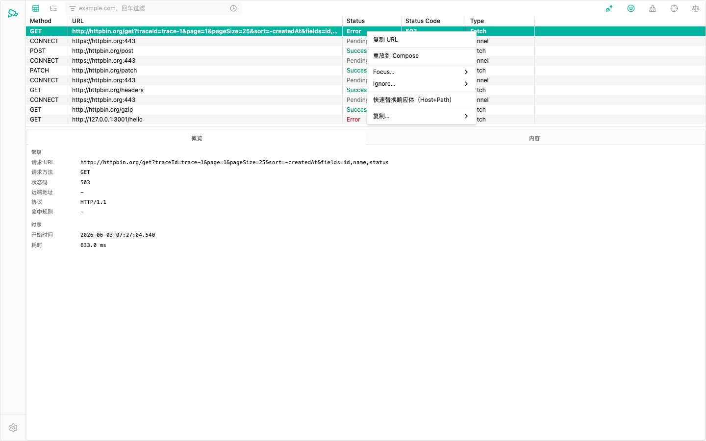
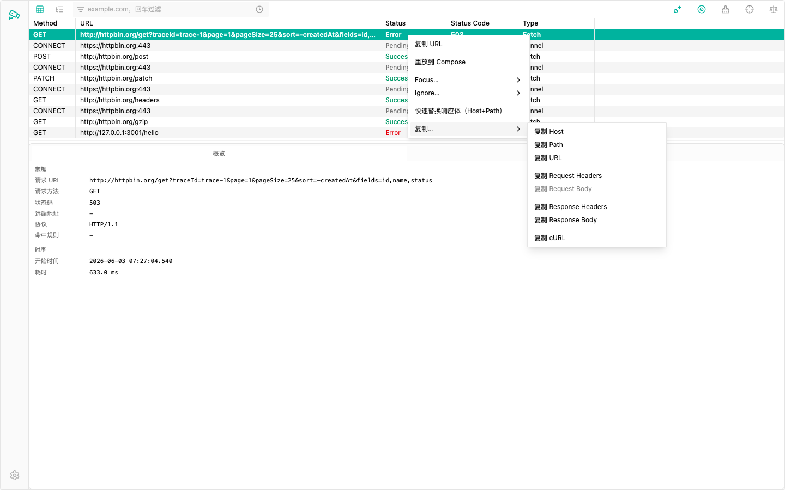
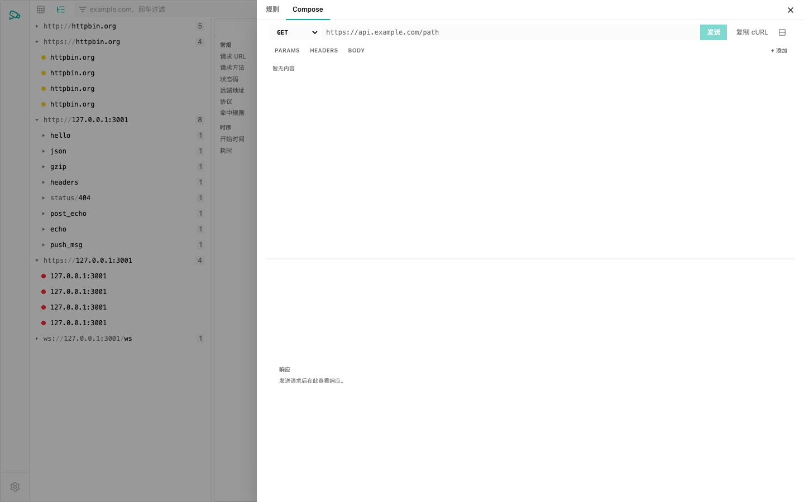

# Lynx Proxy

English | [简体中文](README.zh-CN.md)

[](./LICENSE)
[](https://crates.io/crates/lynx-core)

**Lynx Proxy** is a Rust-based HTTP(S) / WebSocket proxy and traffic inspector for local development. Built on hyper, axum, and tower, it helps you inspect APIs, rewrite traffic with rules, inject scripts, and point static assets to local services — without installing a separate runtime.

## Why Lynx

- **Single binary** — install with one script; the Web UI ships inside the CLI.
- **Local-first** — bind to loopback by default; your traffic stays on your machine.
- **Developer-oriented** — list & tree views, DSL filters, rules, and a built-in Compose panel.

## Features

### Protocols & client

- HTTP(S) and WebSocket(S) interception
- Embedded Web UI (Vue 3 + Vite), light/dark theme, PWA-friendly
- Real-time request stream over WebSocket

### Network panel

- **Table view** — sortable virtualized list with request/response detail
- **Tree view** — group by host and path
- **DSL filter** — filter captured traffic with match expressions
- **Focus / Ignore** — quick capture filters from the toolbar or context menu

### Rules

Each rule has a **match expression** (`matchExpr`), one or more **actions** (handlers), plus `priority` and `enabled`. The network panel **DSL filter** uses the same syntax as `matchExpr`; it only filters the UI list and does not rewrite traffic.

**How matching runs**

- Every **enabled** rule whose `matchExpr` matches the request is included (not first-match-only).
- Handlers from all matching rules are merged and run in **`executionOrder`** ascending (lower runs first).
- **Block** and **Local file** can return a response during the request phase and skip the upstream call.
- After the upstream response, **Modify response**, **HTML script injector**, **Delay** (`afterRequest` / `both`), and **Throttle** run again on the response body/stream.


```mermaid
flowchart LR
  req[IncomingRequest] --> match[Eval matchExpr on RequestFacts]
  match --> merge[Merge handlers from all matching rules]
  merge --> sort[Sort by executionOrder]
  sort --> reqHandlers[Request-phase handlers]
  reqHandlers -->|short-circuit| resp[Return synthetic response]
  reqHandlers -->|continue| upstream[Upstream fetch]
  upstream --> resHandlers[Response-phase handlers]
```

**Focus / Ignore** (toolbar or context menu) uses domain capture filters in Settings, not `matchExpr`. You can still right-click a request to copy cURL or create a rule from its URL.

#### matchExpr DSL

Expressions combine URL-like fragments with optional curl-style flags. Logical operators `AND`, `OR`, `NOT` (and `and` / `or` / `not`) and parentheses are supported. Line comments start with `#`.

| Form | Example | Meaning |
|------|---------|---------|
| Host | `example.com` | Host match (includes subdomains, e.g. `api.example.com`) |
| Host + port | `example.com:8080` | Host and port |
| Path | `/api/v1` | Path prefix (`/api` also matches `/api/foo`) |
| Glob | `/api/*/v1`, `/api/**/track` | Single-segment `*` or multi-segment `**` |
| Full URL | `https://example.com/api?a=1` | Scheme, host, port, path, query |
| Query only | `?user_id=123` | Query parameter **subset** match (extra params allowed) |
| Logic | `A AND B`, `NOT A`, `(A OR B)` | Combine sub-expressions |

**curl-style flags** (after a URL fragment; combined with AND):

| Flag | Role |
|------|------|
| `-X` / `--request` | HTTP method, e.g. `-X POST` |
| `-H` / `--header` | Header equality, e.g. `-H Authorization=Bearer` (name case-insensitive) |
| `-q` / `--query` | Query substring, e.g. `-q foo=bar` |

Examples:

```
example.com AND /api/v1
https://example.com/health
httpbin.org AND -X POST
(example.com OR /api/) AND NOT https://example.com/health
NOT */rest/* AND -X POST
?operationName=GetFeed
```

**Matching notes**

- Path-only expressions do not check host; query-only expressions do not check path.
- Query embedded in a URL (`?a=1&b=2`) uses subset semantics; the live request may include more parameters.
- Path matching ignores the query string when the expression has no `?…` clause.
- For **origin-form** requests (path-only URI), host and port come from the **Host** header.

#### Actions

A rule may attach multiple actions; use `executionOrder` to sequence them. Seed demo rules with `task readme-demo` (see [`scripts/fixtures/demo-rules.json`](scripts/fixtures/demo-rules.json)).

| Action | Use case | Main fields |
|--------|----------|-------------|
| Modify request | Change request before forward | `modifyHeaders`, `modifyMethod`, `modifyUrl`, `modifyBody` |
| Modify response | Change response headers/body/status | `modifyHeaders`, `modifyBody`, `modifyStatusCode` |
| Block | Return an error without upstream | `statusCode`, `reason` |
| Delay | Simulate latency | `delayMs`, `varianceMs`, `delayType` (`beforeRequest` / `afterRequest` / `both`) |
| Throttle | Bandwidth/latency preset | `preset` (`Fast3G` / `Slow3G` / `Offline` / `Custom`), optional `downloadKbps`, `uploadKbps`, `latencyMs` |
| Proxy forward | Rewrite upstream target | `targetScheme`, `targetAuthority`, `targetPath` |
| Local file | Respond from disk | `filePath`, `contentType`, `statusCode` |
| HTML script injector | Inject into HTML responses | `content`, `injectionPosition` (`head` / `body-start` / `body-end`) |

Example rule (modify request headers when POSTing to httpbin):

```json
{
  "name": "Inject demo header",
  "enabled": true,
  "priority": 50,
  "capture": { "matchExpr": "httpbin.org AND -X POST" },
  "handlers": [{
    "handlerType": { "type": "modifyRequest", "modifyHeaders": { "X-Lynx-Demo": "readme" } },
    "executionOrder": 10,
    "enabled": true
  }]
}
```

### Compose (API debug)

Send HTTP requests from the UI, edit params/headers/body, and inspect responses — similar to Postman, integrated with the same proxy session.

### CLI

- `start` / `stop` / `restart` — background daemon
- `run` — foreground server (default port **7788**)
- `status` — process, port, and data directory

Cross-platform: **Windows**, **macOS**, **Linux**.

## Screenshots

### HTTP / HTTPS



### WebSocket


### Tree view



### Rules



### Context menu





### Compose



### CLI status

```bash
$ lynx status
=== Lynx Proxy Service Status ===
PID: 101744
Port: 7788
Status: Running
Data Directory: ~/.local/share/lynx
Start Time: 1749816127 seconds since epoch
Process Running: Yes
```

## Usage

### Install

Prebuilt releases are published on [GitHub Releases](https://github.com/suxin2017/lynx-proxy/releases). The install scripts are named **`lynx-cli-installer.*`** (cargo-dist package name), but they install the **`lynx`** command.

> **Note (v0.4.8 and earlier):** installers built before the repo rename still download binaries from `suxin2017/lynx-server` internally. The script URL can use either `lynx-proxy` or `lynx-server` — both hosts mirror the same release assets today. Future releases (after updating `repository` in `Cargo.toml`) will point entirely at `lynx-proxy`.

**macOS / Linux (recommended)**

```bash
curl --proto '=https' --tlsv1.2 -LsSf \
  https://github.com/suxin2017/lynx-proxy/releases/latest/download/lynx-cli-installer.sh | sh
```

**Windows (PowerShell)**

```powershell
powershell -ExecutionPolicy Bypass -c "irm https://github.com/suxin2017/lynx-proxy/releases/latest/download/lynx-cli-installer.ps1 | iex"
```

After install:

- Binary: **`lynx`** (not `lynx-cli`)
- Default location: `~/.cargo/bin/lynx` — add it to your `PATH` if the installer did not
- Verify: `lynx --version`

**Manual download** (from [Releases](https://github.com/suxin2017/lynx-proxy/releases)):

| Platform | Archive |
|----------|---------|
| macOS (Intel) | `lynx-cli-x86_64-apple-darwin.tar.xz` |
| macOS (Apple Silicon) | `lynx-cli-aarch64-apple-darwin.tar.xz` |
| Linux (x64) | `lynx-cli-x86_64-unknown-linux-gnu.tar.xz` |
| Windows (x64) | `lynx-cli-x86_64-pc-windows-msvc.zip` |

ARM Linux is not in the release matrix yet — build from source (see Development).

**Build from source**

```bash
git clone https://github.com/suxin2017/lynx-proxy.git
cd lynx-proxy
task build-ui && cargo install --path crates/lynx-cli
```

### Quick start

1. Start the proxy:

   ```bash
   lynx run
   ```

2. Point your browser or app at `http://127.0.0.1:7788` (or configure the system HTTP proxy).

3. Open the Web UI at **http://127.0.0.1:7788** and enable capture.

4. Install the Lynx CA certificate from **Settings** when you need HTTPS decryption. For mobile Wi‑Fi proxy, use your computer's LAN IP (not `127.0.0.1`).

### Common commands

```bash
lynx run          # foreground, default port 7788
lynx start        # background daemon
lynx stop
lynx restart
lynx status
```

### Options (`run` / `start`)

| Option | Default | Description |
|--------|---------|-------------|
| `--port` | `7788` | Proxy listen port |
| `--data-dir` | OS-specific | Rules and persistent data |
| `--log-level` | `info` | `silent`, `info`, `error`, `debug`, `trace` |
| `--connect-type` | `sse` | `sse` or `short-poll` |
| `--local-only` | off | Bind to loopback only |

Default data directories:

- Linux: `~/.local/share/lynx`
- macOS: `~/Library/Application Support/lynx`
- Windows: `%APPDATA%\suxin2017\lynx\data`

## Development

Requires [Rust](https://rustup.rs/), [Node.js](https://nodejs.org/) 20+, and [Task](https://taskfile.dev/).

```bash
task setup-ui    # npm ci in ui/
task dev         # proxy :7788 + Vite UI :5173
```

Other useful tasks:

| Task | Purpose |
|------|---------|
| `task build-ui` | Production UI build → embedded in CLI |
| `task traffic-sample` | Send sample HTTP(S) through the proxy |
| `task readme-demo` | Seed demo traffic & rules for docs |
| `task readme-screenshots` | Regenerate `images/*.png` (uses system Chrome) |

See [ui/README.md](ui/README.md) for UI architecture and screenshot workflow.

### Contributing

1. Fork the repo and create a branch.
2. `task setup-ui && task dev`
3. Make changes; run `task test` and `task lint` when touching Rust.
4. Open a Pull Request.

## License

MIT — see [LICENSE](LICENSE).

## Feedback

Questions and ideas: [GitHub Issues](https://github.com/suxin2017/lynx-proxy/issues).

## Status

Usable for daily development; features and UI are still evolving — contributions welcome.
