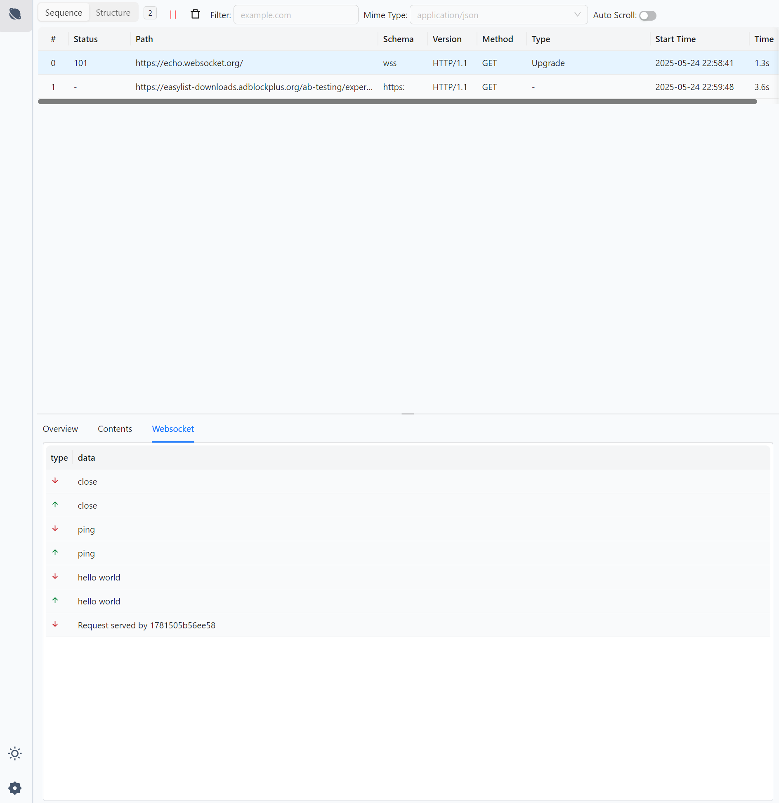
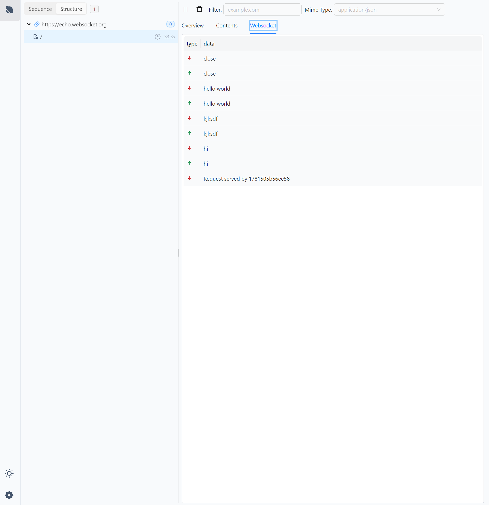

# Lynx Proxy

[English](README.md) | 简体中文

[](./LICENSE)
[](https://crates.io/crates/lynx-core)

**Lynx Proxy** 是一款基于 Rust 语言开发的高性能、灵活的代理工具，专为高效处理 HTTP/HTTPS 及 WebSocket 流量而设计。项目采用 hyper、axum、tower 等主流 Rust 网络库，并配备现代化 Web 客户端（支持暗黑模式），适用于多种网络环境和需求。

## 功能特性

- 🚀 **高性能**：充分利用 Rust 的性能与安全性。
- 🌐 **支持 HTTP/HTTPS**：高效代理 HTTP 和 HTTPS 流量。
- 🔗 **支持 WebSocket**：原生支持 WebSocket 代理。
- 🦀 **Rust 生态**：基于 hyper、axum、tower 等主流库开发。
- 💻 **现代 Web 客户端**：提供直观易用的 Web 管理界面，支持暗黑模式。
- 📋 **列表视图**：支持以结构化列表格式查看 HTTP 请求和响应。
- 🌲 **树形视图**：以直观的树形结构可视化请求数据，提供更好的组织和分析体验。

## 功能展示

### HTTP/HTTPS 代理


### WebSocket 代理



### 树形结构视图



## 安装

通过一键安装脚本快速安装 Lynx Proxy：

```bash
curl --proto '=https' --tlsv1.2 -LsSf https://github.com/suxin2017/lynx-server/releases/latest/download/lynx-cli-installer.sh | sh
```

## 快速开始

```bash
# 启动服务
lynx-cli
```

```
A proxy service

Usage: lynx-cli [OPTIONS]

Options:
  -p, --port <PORT>            proxy server port [default: 3000]
      --log-level <LOG_LEVEL>  log level [default: silent] [possible values: silent, info, error, debug, trace]
      --data-dir <DATA_DIR>    data dir if not set, use default data dir
  -h, --help                   Print help
  -V, --version                Print version
```

## 贡献指南

欢迎社区贡献！请按照以下流程参与开发：

1. Fork 本仓库
2. 创建新分支：`git checkout -b feature-branch`
3. 安装依赖
   - 安装 [taskfile](https://taskfile.dev/)
   - 安装 UI 相关依赖
     ```bash
     task setup-ui
     ```
   - 启动开发环境
     ```bash
     task dev
     ```
4. 提交更改：`git commit -am 'Add new feature'`
5. 推送分支：`git push origin feature-branch`
6. 创建 Pull Request

## 许可证

本项目采用 MIT 许可证，详情请参阅 [LICENSE](LICENSE) 文件。

## 联系我们

如有任何问题或建议，请通过 GitHub Issues 提交反馈。

## 项目状态

项目仍在持续开发中，欢迎关注和参与！

## 未来规划

https://v0-modern-proxy-tool-wq.vercel.app/
