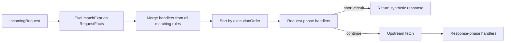

# Lynx Proxy

[English](README.md) | 简体中文

[](./LICENSE)
[](https://crates.io/crates/lynx-core)

**Lynx Proxy** 是一款基于 Rust 的 HTTP(S) / WebSocket 本地代理与抓包工具，采用 hyper、axum、tower 等主流网络库。适用于移动端联调查看接口、Web 开发时将静态资源指向本地、脚本注入、按规则改写/拦截流量等场景 —— 安装为单一可执行文件，无需额外运行时。

## 为什么选择 Lynx

- **开箱即用**：一行脚本安装，Web 界面内嵌在 CLI 中。
- **本地优先**：默认仅监听本机，流量留在你的机器上。
- **面向开发**：列表/树形视图、DSL 过滤、规则引擎、内置 Compose 发请求。

## 功能特性

### 协议与客户端

- 支持 HTTP(S)、WebSocket(S) 抓包与展示
- 现代 Web 客户端（Vue 3 + Vite），亮色/暗色主题，支持 PWA
- 通过 WebSocket 实时推送请求流

### 请求面板

- **列表视图**：虚拟滚动表格，下方展示请求/响应详情
- **树形视图**：按 Host、路径分组浏览
- **DSL 过滤**：用匹配表达式筛选已捕获流量
- **Focus / Ignore**：工具栏或右键菜单快速添加捕获范围

### 规则捕获与处理

规则用于按条件 **改写 / Mock / 拦截 / 重定向** 流量。每条规则包含：

- **匹配表达式**（`matchExpr`）
- 一个或多个 **Action**（后端称 handler）
- `enabled`（开关）与 `priority`（规则之间的排序）

请求面板顶栏的 **DSL 过滤**与规则的 `matchExpr` **语法相同**，但它 **只影响界面筛选**，不会改写流量。

#### 3 分钟上手（UI）

1. 启动 Lynx 并打开 Web UI。
2. 打开 **规则抽屉**，先选择一个 **项目** Tab（或保持 `Default`）。
3. 点击 **新建**，填写：
   - **matchExpr**：`httpbin.org AND /anything`
   - 添加一个 Action：**修改响应** → 将响应 Body 设置为 `hello from lynx`
   - 打开 **Enabled**，然后 **保存**。
4. 触发一条命中该规则的请求（例如访问 `https://httpbin.org/anything`），确认响应被替换。

提示：`task readme-demo` 会写入演示流量与演示规则（见 `scripts/fixtures/demo-rules.json`）。

#### 常用配方（可直接复制）

**拦截某个接口**

```text
example.com AND /api/v1/forbidden
```

Action：**拦截（Block）** → `statusCode=403`，`reason="Blocked by Lynx rule"`。

**仅对 POST 注入请求头**

```text
httpbin.org AND -X POST
```

Action：**修改请求** → 添加 Header `X-Lynx-Demo: readme`。

**重定向上游（Proxy forward）**

```text
example.com AND /static/**
```

Action：**Proxy forward** → 将 `targetScheme/targetAuthority/targetPath` 指向本地服务（例如 Vite/webpack dev server）。

**用本地文件响应**

```text
example.com AND /assets/app.js
```

Action：**本地文件（Local file）** → `filePath=/绝对或相对路径/app.js`。

#### 匹配与执行机制

- 所有 **已启用** 且 `matchExpr` 命中的规则都会生效（不是「只取第一条」）。
- 各规则下的 handler 合并后按 **`executionOrder` 升序**执行（数值越小越先执行）。
- 请求阶段 **拦截（Block）**、**本地文件（Local file）** 可直接返回响应并跳过上游请求。
- 上游响应返回后，会再次执行响应阶段的 Action（例如 **修改响应**、**HTML 脚本注入**、**延迟** 的 `afterRequest/both`、**限速** 等）。


```mermaid
flowchart LR
  req[IncomingRequest] --> match[Eval matchExpr on RequestFacts]
  match --> merge[Merge handlers from all matching rules]
  merge --> sort[Sort by executionOrder]
  sort --> reqHandlers[Request-phase handlers]
  reqHandlers -->|short-circuit| resp[Return synthetic response]
  reqHandlers -->|continue| upstream[Upstream fetch]
  upstream --> resHandlers[Response-phase handlers]
```

**Focus / Ignore**（工具栏或右键）使用 **设置** 中的域名捕获过滤器，不是 `matchExpr`。仍可在请求列表 **右键** 复制 cURL 或基于当前 URL 创建规则。

#### matchExpr DSL

表达式由类 URL 片段与可选的 curl 风格参数组成，支持 `AND`、`OR`、`NOT`（及 `and` / `or` / `not`）与括号；`#` 开头为行注释。

| 形式 | 示例 | 含义 |
|------|------|------|
| Host | `example.com` | 主机匹配（含子域，如 `api.example.com`） |
| Host + 端口 | `example.com:8080` | 主机与端口 |
| 路径 | `/api/v1` | 路径前缀（`/api` 也匹配 `/api/foo`） |
| Glob | `/api/*/v1`、`/api/**/track` | 单段 `*` / 多段 `**` 通配 |
| 完整 URL | `https://example.com/api?a=1` | scheme、host、port、path、query 组合 |
| 仅 query | `?user_id=123` | query 参数 **子集** 匹配（允许多余参数） |
| 逻辑 | `A AND B`、`NOT A`、`(A OR B)` | 组合子表达式 |

**curl 风格参数**（写在 URL 片段之后，与 URL 条件 AND）：

| 参数 | 作用 |
|------|------|
| `-X` / `--request` | HTTP 方法，如 `-X POST` |
| `-H` / `--header` | Header 精确匹配，如 `-H Authorization=Bearer`（名称大小写不敏感） |
| `-q` / `--query` | query 子串包含，如 `-q foo=bar` |

示例：

```
example.com AND /api/v1
https://example.com/health
httpbin.org AND -X POST
(example.com OR /api/) AND NOT https://example.com/health
NOT */rest/* AND -X POST
?operationName=GetFeed
```

**匹配说明**

- 只写路径时不校验 host；只写 `?k=v` 时不校验路径。
- URL 内嵌的 `?a=1&b=2` 为子集语义，实际请求可带更多 query 参数。
- 表达式未包含 `?…` 时，路径匹配与 query 无关。
- **origin-form** 请求（URI 仅有 path）时，host/port 来自 **Host** 头。

#### Action（动作）

同一规则可配置多个 Action，用 `executionOrder` 控制顺序。

| Action | 典型用途 | 主要字段 |
|--------|----------|----------|
| Modify request | 转发前改请求 | `modifyHeaders`、`modifyMethod`、`modifyUrl`、`modifyBody` |
| Modify response | 改响应头/体/状态码 | `modifyHeaders`、`modifyBody`、`modifyStatusCode` |
| Block | 不访问上游，直接返回 | `statusCode`、`reason` |
| Delay | 模拟延迟 | `delayMs`、`varianceMs`、`delayType`（`beforeRequest` / `afterRequest` / `both`） |
| Throttle | 带宽/延迟预设 | `preset`（`Fast3G` / `Slow3G` / `Offline` / `Custom`），可选 `downloadKbps`、`uploadKbps`、`latencyMs` |
| Proxy forward | 改写上游目标 | `targetScheme`、`targetAuthority`、`targetPath` |
| Local file | 本地文件响应 | `filePath`、`contentType`、`statusCode` |
| HTML script injector | 向 HTML 注入脚本 | `content`、`injectionPosition`（`head` / `body-start` / `body-end`） |

示例规则（对 httpbin 的 POST 注入请求头）：

```json
{
  "name": "注入调试 Header",
  "enabled": true,
  "priority": 50,
  "capture": { "matchExpr": "httpbin.org AND -X POST" },
  "handlers": [{
    "handlerType": { "type": "modifyRequest", "modifyHeaders": { "X-Lynx-Demo": "readme" } },
    "executionOrder": 10,
    "enabled": true
  }]
}
```

#### 项目规则文件（`.lynx.json`）

在项目根目录用 **`.lynx.json`** 管理可纳入 Git 的代理规则。默认路径为运行命令时的当前目录下的 `./.lynx.json`；代理运行时数据仍在 `--data-dir`（默认随系统）。

规则按 **项目** 组织（每条规则带 `project` 标签）。UI 提供项目 Tab；CLI 使用 `--project <id>`（默认取 `data_dir/settings/projects.json` 中的当前项目）。`.lynx.json` 中每条规则有稳定的 **`id`**，供 pull/apply 按 id 匹配。

`.lynx.json` 已支持 **JSON Schema**：文件顶层会包含 **`$schema`** 字段，VSCode/Cursor 可据此进行校验与自动补全。

Schema URL 形式（固定到版本 tag）：`https://raw.githubusercontent.com/suxin2017/lynx-proxy/v<version>/schemas/rules-export.schema.json`

| 命令 | 说明 |
|------|------|
| `lynx rules pull` | 从 `.lynx.json` 拉取 → 代理数据目录（按 `id` upsert）；文件不存在时自动创建；导入前自动备份；**不会**删除配置文件中未列出的已有规则。 |
| `lynx rules push` | 从代理数据目录推送已持久化的规则 → `.lynx.json`（按 rule `id` 合并）；文件不存在时自动创建（生成 `configId`）。 |
| `lynx rules apply` | **仅同步开关** — 在配置所属项目内，按 `id` 同步 `enabled` 开关；不创建、不删除、不改规则内容。若规则只存在于配置文件中，apply 会跳过它 —— 先执行 `lynx rules pull`。 |

在本仓库中（重新）生成 schema 文件：

```bash
lynx rules schema export --out schemas/rules-export.schema.json
```

团队协作示例：

```bash
# UI 编辑规则后
lynx rules push --project example-project
git add .lynx.json && git commit -m "chore: 更新代理规则"

# git pull / 切换分支后
lynx rules pull     # 同步规则定义
lynx rules apply    # 同步哪些规则处于开启状态
```

共用参数：`--file <路径>`（默认 `./.lynx.json`）、`--data-dir <路径>`、`--project <id>`。

代理会在下一次请求时自动从磁盘重新加载规则，**无需 restart**。

#### 排错清单（规则不生效时）

- **UI 过滤 vs 规则**：请求面板 DSL 过滤只影响列表显示，不会改写流量。
- **项目 Tab**：规则列表是按项目分组的，确认你在当前项目里编辑/开启了规则。
- **Enabled + 顺序**：确认规则已开启，且 `executionOrder` 合理；可能被更早执行的规则短路（Block/Local file）。
- **匹配要素**：origin-form 请求（URI 只有 path）时 host/port 来自 `Host` 头；只写 path 或只写 `?k=v` 的语义也不同（见上方“匹配说明”）。

### Compose（API 调试）

在界面内直接构造并发送 HTTP 请求，编辑 Query / Header / Body，查看响应 —— 类似 Postman，与当前代理会话一体。

### 命令行

- `start` / `stop` / `restart` — 后台守护进程
- `run` — 前台启动（默认端口 **7788**）
- `status` — 查看进程、端口、数据目录
- `rules push` / `rules pull` / `rules apply` — 项目级 `.lynx.json` 规则配置（见上文）
- `cert install` / `cert status` / `cert uninstall` — macOS 下将根 CA 安装到 System Keychain（需管理员授权）

跨平台：**Windows**、**macOS**、**Linux**。

### 信任根证书（macOS）

HTTPS 解密需信任 Lynx 根 CA。macOS 上可一键安装到 **System Keychain**：

```bash
lynx cert install
lynx cert status
```

- 当前仅支持 **macOS**；其他平台仍可在 Web UI **设置** 中下载证书手动安装。
- 不支持 Firefox（独立 NSS 库）及启用证书固定（Certificate Pinning）的应用。
- 根 CA 具备本地 HTTPS 解密能力，请仅在可信环境使用。
- 若删除并重建数据目录，`lynx cert status` 可能显示 `mismatch`，需先 `uninstall` 再 `install`。
- 安装到 System Keychain 需要管理员授权。

## 功能展示

### HTTP / HTTPS 代理


### WebSocket 代理


### 树形结构视图


### 规则配置


### 一键添加规则


### 发送请求（Compose）


### CLI 查询状态

```bash
$ lynx status
=== Lynx Proxy Service Status ===
PID: 101744
Port: 7788
Status: Running
Data Directory: ~/.local/share/lynx
Start Time: 1749816127 seconds since epoch
Process Running: Yes
```

## 使用

### 安装

预编译包发布在 [GitHub Releases](https://github.com/suxin2017/lynx-proxy/releases)。安装脚本文件名为 **`lynx-cli-installer.*`**（cargo-dist 包名），安装后的命令是 **`lynx`**。

> **说明（v0.4.8 及更早版本）：** 仓库改名前的安装脚本，会从 `suxin2017/lynx-server` 下载二进制；脚本本身的 URL 用 `lynx-proxy` 或 `lynx-server` 均可，两个仓库目前镜像同一份 Release 资源。后续发版（已修正 `Cargo.toml` 中的 `repository`）将统一指向 `lynx-proxy`。

**macOS / Linux（推荐）**

```bash
curl --proto '=https' --tlsv1.2 -LsSf \
  https://github.com/suxin2017/lynx-proxy/releases/latest/download/lynx-cli-installer.sh | sh
```

**Windows（PowerShell）**

```powershell
powershell -ExecutionPolicy Bypass -c "irm https://github.com/suxin2017/lynx-proxy/releases/latest/download/lynx-cli-installer.ps1 | iex"
```

安装完成后：

- 命令名：**`lynx`**（不是 `lynx-cli`）
- 默认路径：`~/.cargo/bin/lynx`，若终端找不到命令请将其加入 `PATH`
- 验证：`lynx --version`

**手动下载**（见 [Releases](https://github.com/suxin2017/lynx-proxy/releases)）：

| 平台 | 压缩包 |
|------|--------|
| macOS（Apple Silicon） | `lynx-cli-aarch64-apple-darwin.tar.xz` |
| Linux（x64） | `lynx-cli-x86_64-unknown-linux-gnu.tar.xz` |
| Windows（x64） | `lynx-cli-x86_64-pc-windows-msvc.zip` |

不再构建 Intel macOS 包（避免 CI 在 `macos-13` 上长时间排队）；Intel Mac 可用 Rosetta 运行 Apple Silicon 包，或从源码构建。ARM Linux 暂无官方预编译包 — 请从源码构建（见「开发」）。

**从源码构建**

```bash
git clone https://github.com/suxin2017/lynx-proxy.git
cd lynx-proxy
task build-ui && cargo install --path crates/lynx-cli
```

### 快速开始

1. 启动代理：

   ```bash
   lynx run
   ```

2. 将浏览器或应用的 HTTP 代理指向 `127.0.0.1:7788`（或按系统代理设置）。

3. 浏览器打开 **http://127.0.0.1:7788**，进入 Web 界面并开启录制。

4. 需要解密 HTTPS 时，在 **设置** 中安装 Lynx 根证书（手机 Wi‑Fi 代理请填电脑的局域网 IP，勿填 `127.0.0.1`）。

### Android 一键代理（ADB）

在 Web 界面打开 **规则抽屉 → Android** 标签页，可：

1. **首次使用**：懒下载 Google platform-tools（存入 Lynx 数据目录）；若系统 `PATH` 中已有 `adb` 则直接使用。
2. **列出设备**：USB 调试或已配对的无线调试；在列表中选择设备。
3. **开启/关闭代理**（通过 `settings put global http_proxy`，无需 root）：
   - **同一 WiFi**：手机与电脑同网段，代理指向电脑的局域网 IP 与 Lynx 端口（默认 7788）。Lynx 若以 `--local-only` 启动则不可用，请改用 USB 模式或去掉该参数。
   - **USB（adb reverse）**：执行 `adb reverse` 后，手机代理填 `127.0.0.1:7788`，不依赖同一 WiFi。
4. **HTTPS**：仍需在 **设置** 中下载并安装 Lynx 根证书到手机。

关闭 Lynx **不会**自动清除手机代理；离开前请在 Android 面板点击「关闭代理」。

### 常用命令

```bash
lynx run          # 前台运行，默认 7788
lynx start        # 后台守护进程
lynx stop
lynx restart
lynx status
lynx rules push      # 导出已持久化规则 → ./.lynx.json
lynx rules pull      # 从 ./.lynx.json 导入 → 数据目录（先备份）
lynx rules apply     # 仅同步开关：按配置切换 enabled（必要时先 pull）
```

### 参数说明（`run` / `start`）

| 参数 | 默认值 | 说明 |
|------|--------|------|
| `--port` | `7788` | 代理监听端口 |
| `--data-dir` | 随系统 | 规则与持久化数据目录 |
| `--log-level` | `info` | `silent`、`info`、`error`、`debug`、`trace` |
| `--connect-type` | `sse` | `sse` 或 `short-poll` |
| `--local-only` | 关闭 | 仅绑定本机回环地址 |

默认数据目录：

- Linux：`~/.local/share/lynx`
- macOS：`~/Library/Application Support/lynx`
- Windows：`%APPDATA%\suxin2017\lynx\data`

## 开发

需要 [Rust](https://rustup.rs/)、[Node.js](https://nodejs.org/) 20+、[Task](https://taskfile.dev/)。

```bash
task setup-ui    # 安装 ui 依赖
task dev         # 代理 :7788 + Vite 开发界面 :5173
task lynx -- rules push   # 不安装，直接跑本地 CLI
task dev-lynx    # 前台启动代理（debug 构建）
```

其他常用任务：

| 任务 | 用途 |
|------|------|
| `task build-ui` | 构建生产 UI 并嵌入 CLI |
| `task install-lynx` | 安装 debug 版 `lynx` 到 `~/.cargo/bin` |
| `task lynx -- …` | 运行本地 CLI（如 `task lynx -- rules pull`） |
| `task dev-lynx` | 从源码前台启动代理（debug 构建） |
| `task traffic-sample` | 经代理发送示例 HTTP(S) 流量 |
| `task readme-demo` | 写入文档用演示流量与规则 |
| `task readme-screenshots` | 重新生成 `images/*.png`（使用系统 Chrome） |

UI 架构与截图流程见 [ui/README.md](ui/README.md)。

### 贡献指南

1. Fork 仓库并创建分支。
2. 执行 `task setup-ui && task dev` 启动开发环境。
3. 修改代码；涉及 Rust 时可运行 `task test`、`task lint`。
4. 提交 Pull Request。

## 许可证

MIT，详见 [LICENSE](LICENSE)。

## 反馈

问题与建议请通过 [GitHub Issues](https://github.com/suxin2017/lynx-proxy/issues) 提交。

## 项目状态

已可用于日常开发，功能与界面仍在持续迭代，欢迎 Star 与贡献。
